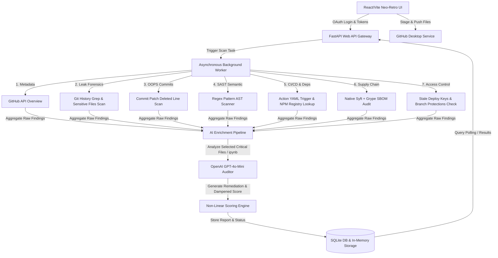

<div align="center">
  
  <br/>
  <h1>🛡️ GitHub Guardian</h1>
  <p><strong>Deep Forensic Security Audit Engine, AI Code Interpreter & Browser-Based GitHub Desktop Client</strong></p>

  [](https://fastapi.tiangolo.com)
  [](https://reactjs.org/)
  [](https://vitejs.dev/)
  [](#)
  [](#)
  [](#)
  [](#)
</div>

---

## ⚡ Introduction

**GitHub Guardian** is an enterprise-grade, high-fidelity security auditing and repository manager built to resolve the pervasive "signal-to-noise" challenge in modern DevSecOps. Traditional static scanners overwhelm development teams with low-priority warnings. GitHub Guardian introduces **Forensic-Level Impact Auditing**—combining live credential scan patterns, Git history DAG traversal, AST-like semantic checks, dependency confusion registry verification, CI/CD misconfiguration scans, and Syft/Grype supply chain SBOM generators.

All scan findings are enriched via an **AI Technical Reviewer** (powered by OpenAI `gpt-4o-mini`) that analyzes repository code structures—including Jupyter Notebooks (`.ipynb` files)—to produce structural architectural analyses and actionable remediation blueprints.

Additionally, GitHub Guardian includes a built-in **GitHub Desktop Portal**: a custom, neo-retro themed web UI that securely integrates with GitHub OAuth, enabling developers to stage local files, generate bulletproof `.gitignore` definitions to prevent leaks *before* they occur, manage branches, and push code synchronously or via AI-mediated pull-requests with automated conflict resolution.

---

## 📐 Systems Architecture & Pipeline

GitHub Guardian is built on a decoupled, asynchronous micro-architecture designed for performance, high throughput, and maximum visibility.



### 🧠 Non-Linear Scoring & Alert Fatigue Prevention
Rather than linearly summing up scores (which quickly blows past maximum limits and creates alert fatigue), the engine implements a dampened weight-based scoring curve:

$$\text{Final Score} = 10 \times \left(1 - 0.85^{\frac{\text{raw\_score}}{2}}\right)$$

#### **Raw Weights Allocation:**
- **Active Credentials Leak**: $5$ points (CRITICAL)
- **Historical Git History Leak**: $2$ points (HIGH)
- **Semantic Code Injection (SQLi/XSS)**: $4$ points (CRITICAL) / $2$ points (HIGH)
- **CI/CD Misconfigurations (`pull_request_target`)**: $4$ points (CRITICAL)
- **Dependency Confusion Vulnerability**: $3$ points (HIGH)
- **Critical CVE Supply Chain Vulnerability**: $3$ points (MEDIUM)

#### **Qualitative Scoring Scale:**
* **`0.0`**: `EXCELLENT` — Forensic-grade security posture. No indicators of compromise or architectural flaws.
* **`1.0 - 3.9`**: `CAUTION` — Minor exposure or historical code smells detected.
* **`4.0 - 6.9`**: `WARNING` — Significant security debt; critical vulnerabilities detected.
* **`7.0 - 8.9`**: `EMERGENCY` — Major structural vulnerabilities; exploitation is highly probable.
* **`9.0 - 10.0`**: `CATASTROPHIC` — Total system compromise; multiple secrets exposed and entry points open.

---

## 🚀 Key Features Deep Dive

### 🛡️ 1. The Multi-Layered Security Auditor
The core auditing runner parses repositories across seven specialized analysis sectors:
* **Leak Forensics**: Scans active files and checks git history (deep logs) using strict regular expressions to hunt down:
  * *AWS Access Keys*, *GitHub Tokens*, *Slack Webhooks*, *Stripe API Keys*, *Google API Keys*, and *RSA/OpenSSH Private Keys*.
  * Recognizes high-risk exposed configuration assets such as `.env`, `docker-compose.yml`, `kubeconfig`, `id_rsa`, `config.json`, and `.pem`/`.key` cryptographic assets.
* **"OOPS" Commit History Traversal**: Traverses Git history patch diffs to isolate deleted lines (prefixed with `-`). This allows developers to detect secrets that were accidentally committed, deleted in a subsequent commit, but remain fully retrievable within the Git packfile history.
* **Semantic SAST Engine**: A file-by-file pattern matching engine checking code patterns across Python, JS/TS, Java, PHP, HTML, and C:
  * **SQL Injection (SQLi)**: Catches string interpolation/concatenation in raw SQL executing pipelines (e.g. `.execute()`, `.query()`).
  * **Cross-Site Scripting (XSS)**: Isolates insecure DOM writing vectors (e.g. React `dangerouslySetInnerHTML`, Vanilla `innerHTML`, Jinja `| safe` filter).
  * **Shell Injection**: Flags dangerous subprocessing (e.g. `shell=True`, Node's `child_process.exec()`).
  * **Hardcoded Credentials**: Detects assignments of raw string variables containing passwords or JWT secrets.
* **Dependency Confusion Scanner**: Safely checks `package.json` configurations. If NPM dependencies feature internal naming patterns or company scopes (e.g., `@company/internal-pkg`) but 404 on the public npmjs registry, the auditor warns developers of potential public registry squatting risks.
* **CI/CD Workflow Auditor**: Parses GitHub Actions `.github/workflows/*.yaml` configuration trees to flag insecure workflow triggers like `pull_request_target` which can allow malicious pull requests to read repository secrets.
* **Supply Chain SBOM Scanner**: Spawns native instances of **Syft** to extract a CycloneDX JSON Software Bill of Materials (SBOM) from a cloned repository directory and uses **Grype** to run high-speed localized CVE matching.
* **Access Auditor**: Checks deploy keys to flag stale credentials active for over 90 days and reports on missing default branch protection rules.

---

### 💻 2. The Browser-Based GitHub Desktop Portal
GitHub Guardian includes a sophisticated terminal interface simulating a high-end mainframe that integrates with GitHub OAuth.
* **Drag-and-Drop Staging**: Stage codebases directly in the web browser.
* **Dynamic `.gitignore` Synthesizer**: Scans your staged files on-the-fly. If it detects unignored `.env` items, credentials, `.pem` keys, or massive folders like `node_modules`, it automatically generates a customized `.gitignore` configuration to lock down files prior to committing.
* **Smart Push Protocols**: Pushes to existing repositories using advanced flows:
  * Automatically handles branch creation.
  * Employs AI-mediated conflict resolution: if conflicts arise during staging, an automated PR is opened and conflicts are resolved safely.
  * Initiates target branch deployments and automated merges.
---

### 🛡️ 3. The GitHub Guardian CLI (Pre-Commit Shield)
GitHub Guardian ships with a powerful, standalone command-line interface designed to protect developers locally before code ever leaves their machine. Available directly from PyPI.
* **Global Installation**: Install instantly via `pipx install github-guardian` (Mac/Linux) or `pip install github-guardian` (Windows).
* **Local Forensics**: Run `guardian scan-local .` to instantly audit your directory for active leaks or SAST vulnerabilities without needing an internet connection.
* **The Pre-Commit Shield**: Run `guardian hook-install` inside any Git repository. The CLI injects a secure Git Hook that automatically intercepts `git commit` commands. If a secret is staged, the commit is **blocked**, and the CLI intelligently asks if you'd like to auto-append the vulnerable file to your `.gitignore`.

---

## 🛠️ Tech Stack & Directory Architecture

### **Backend Core:**
* **FastAPI**: Asynchronous web framework serving REST endpoints.
* **SQLAlchemy & SQLite**: Internal session DB and push tracker.
* **PyGithub**: Python wrapper for interacting with the official GitHub API.
* **Syft & Grype**: Binary-level utilities for SBOM generation and CVE matching.
* **OpenAI (GPT-4o-Mini)**: Architectural code reviewer and insights generator.

### **Frontend Core:**
* **React + Vite**: Ultra-fast SPA configuration.
* **Material UI (MUI)**: Dark-themed components configured with mainframe terminal aesthetics.
* **VT323 Typography**: Authentic retro computer terminal visuals.

---

### 📁 Codebase Directory Tree

```
Crazy-ever/
├── README.md                          # Platform Documentation
├── bootstrap.py                       # Project Bootstrap (Backend & Mock Files Setup)
├── frontend-bootstrap.py              # React / Vite Staging & Setup Utility
│
├── github-guardian-backend/           # FastAPI Asynchronous Auditing Server
│   ├── main.py                        # Entrypoint & Middleware Settings
│   ├── requirements.txt               # Backend Python Dependencies
│   ├── Procfile                       # Deployment Instructions
│   └── src/
│       ├── api/
│       │   └── v1/
│       │       └── endpoints/
│       │           ├── auth.py        # GitHub OAuth login & JWT sessions
│       │           ├── desktop.py     # GitHub Desktop push, branch & merge APIs
│       │           ├── repo.py        # Repo summary & history endpoints
│       │           ├── scan.py        # Async scan trigger & status poller
│       │           └── webhook.py     # GitHub Webhook integration router
│       ├── db/
│       │   ├── models.py              # SQLite Database schemas (PushHistory model)
│       │   └── session.py             # SQLAlchemy Database Session Setup
│       └── services/
│           ├── access_auditor.py      # Checks stale deploy keys & protections
│           ├── ai_interpreter.py      # Computes dampened score & report details
│           ├── ai_reviewer.py         # OpenAI GPT-4o-Mini architecture review
│           ├── ci_cd_analyzer.py      # Audits pull_request_target triggers
│           ├── dependency_confusion.py# Scans NPM public registry for 404 targets
│           ├── github_client.py       # Wrapper for PyGithub API integrations
│           ├── github_desktop.py      # Handles git operations, branches & merges
│           ├── leak_forensics.py      # Scans git history & active files for secrets
│           ├── oops_analyzer.py       # Differential scans of deleted commit diffs
│           ├── sast_analyzer.py       # Semantic SAST regex scans (SQLi, XSS)
│           └── supply_chain.py        # Invokes Syft/Grype for CVE vulnerability scans
│
└── github-guardian-frontend/          # React + Vite Mainframe Application
    ├── package.json                   # Dependency definitions
    ├── vite.config.js                 # Local Vite configurations (Runs on Port 3000)
    ├── index.html                     # SPA Entrypoint HTML
    └── src/
        ├── App.jsx                    # React Routing Rules
        ├── theme.js                   # MUI Retro Theme
        ├── main.jsx                   # React mounting script
        ├── index.css                  # Custom retro CSS styles
        ├── context/
        │   └── AuthContext.jsx        # OAuth User context manager
        └── pages/
            ├── LandingPage.jsx        # Home terminal landing page
            ├── DashboardPage.jsx      # Multi-panel scan overview (Auditor view)
            ├── RepoDetailPage.jsx     # Branch, push, and single repo control panel
            ├── PushHistoryPage.jsx    # Log of recent push events
            └── GithubDesktopPage.jsx  # Main browser-based Git Desktop interface
```

---

## 📡 API Contract Specification

All backend endpoints are structured under the `/api/v1` namespace.

| Category | HTTP Method | Endpoint | Authorization | Payload / Parameters | Responsibility |
| :--- | :--- | :--- | :---: | :--- | :--- |
| **Authentication** | `GET` | `/api/v1/auth/url` | None | None | Generates the GitHub OAuth Redirect authorization link. |
| **Authentication** | `POST` | `/api/v1/auth/callback` | None | `{ "code": "string" }` | Exchanges authorization code for GitHub access token; issues JWT. |
| **Authentication** | `GET` | `/api/v1/auth/me` | Bearer (JWT) | None | Decodes user profile metadata and validates authorization status. |
| **Security Audits** | `POST` | `/api/v1/scan` | None | `{ "owner": "str", "repo_name": "str" }` | Spawns an asynchronous background security scanning task. Returns a `task_id`. |
| **Security Audits** | `GET` | `/api/v1/scan/status/{task_id}` | None | Path Parameter: `task_id` | Returns `pending`, `processing` (with status updates), or `completed` with full payload. |
| **GitHub Desktop** | `GET` | `/api/v1/desktop/check-name/{repo_name}` | Bearer (JWT) | Path Parameter: `repo_name` | Queries GitHub to check if repo name is available for the user. |
| **GitHub Desktop** | `POST` | `/api/v1/desktop/create-and-push` | Bearer (JWT) | Form-Data: `repo_name`, `description`, `private`, `commit_message`, `files` | Creates new repo, synthesizes `.gitignore`, pushes initial branch. |
| **GitHub Desktop** | `POST` | `/api/v1/desktop/smart-push` | Bearer (JWT) | Form-Data: `repo_name`, `commit_message`, `files` | Scans files, commits changes, creates auto PR, resolves conflicts via AI, and merges. |
| **GitHub Desktop** | `GET` | `/api/v1/desktop/github-repos` | Bearer (JWT) | None | Fetches all authorized GitHub repositories directly from the GitHub API. |
| **GitHub Desktop** | `GET` | `/api/v1/desktop/branches/{repo_name}`| Bearer (JWT) | Path Parameter: `repo_name` | Fetches active branches list including last commit data and SHA signatures. |
| **GitHub Desktop** | `POST` | `/api/v1/desktop/create-branch` | Bearer (JWT) | Form-Data: `repo_name`, `new_branch_name`, `base_branch` | Creates a new Git branch based on an existing branch on the remote tree. |
| **GitHub Desktop** | `POST` | `/api/v1/desktop/push-to-branch` | Bearer (JWT) | Form-Data: `repo_name`, `branch_name`, `commit_message`, `files` | Pushes staged file payloads directly into the targeted branch. |
| **GitHub Desktop** | `POST` | `/api/v1/desktop/merge-branch` | Bearer (JWT) | Form-Data: `repo_name`, `source_branch`, `target_branch` | Checks branch conflicts, resolves them via AI, opens PR, and merges. |
| **GitHub Desktop** | `GET` | `/api/v1/desktop/history` | Bearer (JWT) | None | Fetches local SQLite DB history logs of desktop pushes. |

---

## ⚙️ Environment Variables Configuration

Set up environment variables for both backend and frontend to ensure database operations, OpenAI analysis, and OAuth integrations execute properly.

### 🐍 1. Backend Configuration (`github-guardian-backend/.env`)
Create a file named `.env` in the `github-guardian-backend` root folder:

```env
# Server Tokens & Database URLs
GITHUB_TOKEN=ghp_your_fallback_server_token_here
DATABASE_URL=sqlite:///./test.db
REDIS_URL=redis://localhost:6379/0

# GitHub App/OAuth Configurations
GITHUB_CLIENT_ID=Ov23liYourClientIdHere
GITHUB_CLIENT_SECRET=07d09YourClientSecretHere
JWT_SECRET=gh_guardian_jwt_secret_xK9mP2vL8nQ4rT7w

# AI Credentials
OPENAI_API_KEY=sk-proj-YourOpenAIPrivateApiKeyHere

# Network routing variables
FRONTEND_URL=http://localhost:3000
BACKEND_URL=http://localhost:8000

# Integrations & Hooks
SLACK_WEBHOOK_URL=https://hooks.slack.com/services/Your/Slack/Webhook
WEBHOOK_SECRET=mySuperSecretGuardianKey2026
```

### ⚡ 2. Frontend Configuration (`github-guardian-frontend/.env.local`)
Create a file named `.env.local` in the `github-guardian-frontend` root folder:

```env
# Base API Connection Endpoint
VITE_API_BASE_URL=http://localhost:8000
```

---

## 🚀 Setting Up the Application

### 📋 Prerequisites
Before launching, ensure the following are installed:
1. **Python 3.10+** (with virtual environment capability)
2. **Node.js 18+** & **npm**
3. **Syft & Grype** (Optional, for native container SBOM scans)
   ```bash
   brew install syft grype
   ```

---

### 🕹️ Option A: Manual Setup (Step-by-Step)

#### **1. Database & Backend API Setup**
```bash
# Navigate to the backend directory
cd github-guardian-backend

# Initialize virtual environment
python -m venv venv
source venv/bin/activate  # On Windows use: venv\Scripts\activate

# Install all runtime dependencies
pip install -r requirements.txt

# Populate environment variables (.env) based on the guide above

# Launch the FastAPI Web API Server
uvicorn main:app --reload --port 8000
```
Verify the backend is active by visiting `http://localhost:8000/`. You should see:
`{"status":"GUARDIAN SYSTEM ONLINE","message":"Forensic Security Audit Engine is operational."}`

#### **2. Frontend Dashboard Setup**
```bash
# Open a new terminal window and navigate to the frontend directory
cd github-guardian-frontend

# Install node dependencies
npm install

# Build / Run local Vite web server
npm run dev
```
Open your browser and navigate to `http://localhost:3000` to interact with the console dashboard.

---

### 🥾 Option B: Automated Bootstrapping
The repository includes pre-configured automation scripts (`bootstrap.py` and `frontend-bootstrap.py`) in the workspace root. You can run these to stage environment structures and configure modules automatically.

```bash
# Execute structural setup
python bootstrap.py

# Execute frontend dependencies build
python frontend-bootstrap.py
```

---

## 🧪 Testing the Auditor

Want to test GitHub Guardian's forensic scans against live environments? You can target these intentionally vulnerable open-source codebases to watch the audit logs, SAST engine, dependency scanners, and AI score calculations in action:

1. **[OWASP NodeGoat](https://github.com/OWASP/NodeGoat)**: Demonstrates high-risk vulnerabilities, hardcoded database tokens, and database execution gaps in Node.js applications.
2. **[Broken Crystals](https://github.com/BrightSecurity/broken-crystals)**: A modern vulnerable application featuring complex SAST, exposed PEM certificates, and credential issues.
3. **[Juice Shop](https://github.com/juice-shop/juice-shop)**: A modern web app containing numerous security risks and architectural flaws.

---

> *"Security isn't about building a wall. It's about knowing exactly what is happening inside the walls."*  
> **GitHub Guardian System — Forensic Security Auditing for the Modern DevSecOps Era.**
